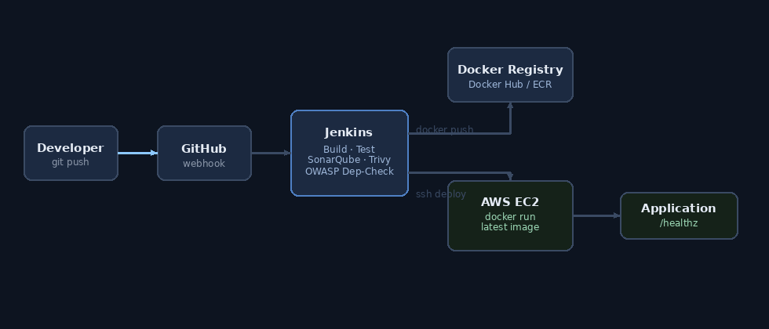
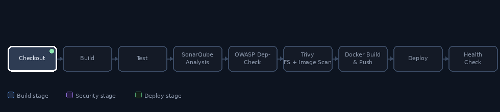

# Jenkins CI/CD Pipeline — DevSecOps Project

Automated CI/CD pipeline using Jenkins, GitHub, Docker, and AWS, with
security scanning built into the pipeline itself (SonarQube, OWASP
Dependency-Check, Trivy). The deployable app is **StreamFlix**, a real,
live "Netflix clone"-style movie browser (Vite + React) that pulls actual
movie data — trending titles, top rated, genres, search — from [The Movie
Database (TMDB)](https://www.themoviedb.org/) API. It uses its own
branding rather than Netflix's actual name/logo (which is trademarked),
but the data, search, and UI are fully live, not mocked.

## Architecture



```
Developer → GitHub → Webhook → Jenkins → Build → Test →
Docker Image → Docker Registry → AWS EC2 → Application
```

## Pipeline stages



```
Checkout → Build → Test → SonarQube Analysis → Quality Gate →
OWASP Dependency-Check → Trivy Scan → Docker Build → Docker Push →
Deploy → Health Check
```

All of this lives in the single [`Jenkinsfile`](Jenkinsfile) — there are
no separate shell scripts to maintain; every step is a stage Jenkins runs
directly.

## Project layout

```
jenkins-devsecops-pipeline/
├── app/                          # StreamFlix demo app (Vite + React)
│   ├── src/
│   │   ├── App.jsx
│   │   ├── App.test.jsx          # unit tests run in the Test stage (TMDB calls mocked)
│   │   ├── App.css
│   │   ├── config.js             # reads the TMDB API key from env
│   │   ├── api/tmdb.js           # TMDB API client (trending, top rated, genres, search)
│   │   ├── main.jsx
│   │   └── setupTests.js
│   ├── index.html
│   ├── package.json
│   ├── vite.config.js
│   ├── Dockerfile                # multi-stage: node build -> nginx serve
│   ├── nginx.conf
│   ├── .env.example
│   └── .dockerignore
├── images/
│   ├── architecture.gif
│   └── pipeline-stages.gif
├── Jenkinsfile                   # the entire pipeline definition
├── sonar-project.properties
├── dependency-check-suppression.xml
└── .gitignore
```

## 1. Get a TMDB API key (one-time, free)

The app needs a free API key from The Movie Database to load real movies:

1. Create an account at [themoviedb.org](https://www.themoviedb.org/signup).
2. Go to **Settings → API → Create → Developer**, fill in the short form
   (any personal-project description is fine).
3. Copy the **"API Key (v3 auth)"** value (not the "API Read Access Token").

## 2. Run the app locally (without Jenkins)

```bash
cd app
cp .env.example .env
# edit .env and paste your key: VITE_TMDB_API_KEY=xxxxxxxx

npm install
npm test           # unit tests (TMDB calls are mocked, no key needed to test)
npm run build       # production build
npm run dev          # local dev server, http://localhost:5173
```

Without a key set, the app still runs and builds fine — it just shows an
in-app notice explaining how to add one, instead of the movie rows.

Or as a container:

```bash
cd app
docker build --build-arg VITE_TMDB_API_KEY=xxxxxxxx -t streamflix-clone .
docker run -p 8081:80 streamflix-clone
# visit http://localhost:8081
```

## 3. Jenkins server setup

Provision an EC2 instance for Jenkins (separate from the deployment
target), open the needed ports, install Jenkins + the scanning tools, then
configure the job.

### Security groups

| Security group | Port | Source | Purpose |
|---|---|---|---|
| `jenkins-sg` | 22 | your IP | SSH admin |
| `jenkins-sg` | 8080 | your IP (or office CIDR) | Jenkins UI |
| `jenkins-sg` | 9000 | your IP | SonarQube UI (if hosted on same box) |
| `deploy-ec2-sg` | 22 | `jenkins-sg` | Jenkins deploys over SSH |
| `deploy-ec2-sg` | 8081 | `0.0.0.0/0` | the running application |

Keep Jenkins and the deployment target as two separate EC2 instances so a
compromised build agent doesn't have direct access to the production
security group beyond SSH.

### Install Jenkins (Amazon Linux 2023 / Ubuntu)

Run these on the Jenkins EC2 instance:

```bash
# Java (required by Jenkins)
sudo dnf install -y java-21-amazon-corretto        # Amazon Linux
# sudo apt install -y openjdk-21-jre                # Ubuntu

# Jenkins repo + install
sudo wget -O /etc/yum.repos.d/jenkins.repo https://pkg.jenkins.io/redhat-stable/jenkins.repo
sudo rpm --import https://pkg.jenkins.io/redhat-stable/jenkins.io-2023.key
sudo dnf install -y jenkins
sudo systemctl enable --now jenkins

# Docker (Jenkins needs it to build/push/deploy images)
sudo dnf install -y docker
sudo systemctl enable --now docker
sudo usermod -aG docker jenkins
sudo systemctl restart jenkins
```

Get the initial admin password:

```bash
sudo cat /var/lib/jenkins/secrets/initialAdminPassword
```

### Install the security scanners on the Jenkins box

```bash
# Trivy
sudo rpm -ivh https://github.com/aquasecurity/trivy/releases/latest/download/trivy_Linux-64bit.rpm

# OWASP Dependency-Check CLI is normally managed via the Jenkins plugin's
# "Global Tool Configuration" (Manage Jenkins -> Tools -> Dependency-Check
# installations -> install automatically). No manual install needed.
```

SonarQube is easiest run as its own container/instance rather than
installed directly on the Jenkins box:

```bash
docker run -d --name sonarqube -p 9000:9000 sonarqube:lts-community
```

### Jenkins plugins to install (Manage Jenkins → Plugins)

- Git
- Pipeline
- NodeJS Plugin
- SonarQube Scanner
- OWASP Dependency-Check
- Docker Pipeline
- SSH Agent
- Credentials Binding

### Jenkins global tool / system configuration

- **Manage Jenkins → Tools**
  - NodeJS installation named `node20` (auto-install, version 20.x)
  - Dependency-Check installation named `owasp-dependency-check`
- **Manage Jenkins → System**
  - SonarQube servers → add server named `sonarqube-server` with its URL
    and an authentication token

### Credentials to add (Manage Jenkins → Credentials)

| ID | Type | Value |
|---|---|---|
| `dockerhub-creds` | Username with password | Docker Hub username/password or access token |
| `ec2-ssh-key` | SSH Username with private key | the deploy EC2 instance's SSH key |
| `sonarqube-token` | Secret text | token generated in SonarQube (My Account → Security) |
| `tmdb-api-key` | Secret text | your TMDB v3 API key, passed into the Docker build |

### Create the pipeline job

1. New Item → Pipeline → name it (e.g. `streamflix-devsecops`).
2. Under **Pipeline**, choose "Pipeline script from SCM", point it at your
   GitHub repo, branch `main`, script path `Jenkinsfile`.
3. Under **Build Triggers**, check "GitHub hook trigger for GITScm polling".

### GitHub webhook

In your GitHub repo: **Settings → Webhooks → Add webhook**
- Payload URL: `http://<jenkins-public-ip>:8080/github-webhook/`
- Content type: `application/json`
- Event: "Just the push event"

Every `git push` to `main` now triggers the full pipeline automatically.

## 4. Editing the Jenkinsfile for your environment

Before your first run, update the placeholder values at the top of
[`Jenkinsfile`](Jenkinsfile):

```groovy
DOCKERHUB_USER = "your-dockerhub-username"
EC2_HOST       = "ec2-user@your-ec2-public-ip"
```

And swap the `usernamePassword`/`sshagent` credential IDs if you named
yours differently in Jenkins.

## 5. What each security stage actually does

- **SonarQube Analysis** — static analysis for code smells, bugs, and
  security hotspots in the React source; the **Quality Gate** stage fails
  the build if SonarQube's configured thresholds aren't met.
- **OWASP Dependency-Check** — scans `package.json`/`package-lock.json`
  dependencies against the NVD for known CVEs.
- **Trivy** — scans both the filesystem (before the image exists) and the
  built Docker image for OS-package and application-dependency
  vulnerabilities.

All three are set to report rather than hard-fail the build by default
(`exit-code 0` for Trivy, dependency-check publisher just records findings)
so you can see results before deciding to gate on them — tighten these
once you've reviewed a few runs and tuned the suppression file.

## 6. Deployment target (the EC2 instance the app runs on)

This is a plain Docker host — no Compose needed since it's a single
container:

```bash
# one-time setup on the deploy EC2 instance
sudo dnf install -y docker
sudo systemctl enable --now docker
sudo usermod -aG docker ec2-user
```

Jenkins' `Deploy to EC2` stage SSHes in, pulls the new image, and restarts
the container. The `Health Check` stage then polls `/healthz` until nginx
responds or the 10 retries run out, failing the build if the app never
comes up.
